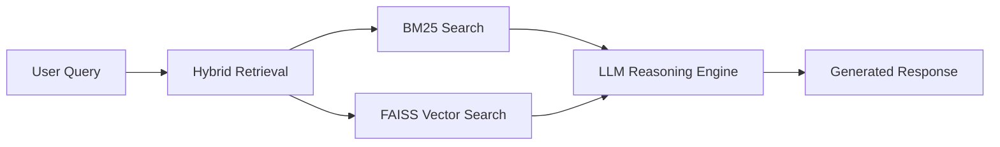

<!-- ========================================================= -->
<!--                NVIDIA STYLE AI ENGINEER README            -->
<!-- ========================================================= -->

<p align="center">


</p>

<p align="center">


</p>

---

# 🖥 SYSTEM TERMINAL

```bash
$ whoami
Parth Singh

$ role
AI Engineer

$ specialization
Machine Learning | NLP | LLM Systems

$ current_focus
Building Intelligent AI Systems
```

---

# 🧠 AI SYSTEM ARCHITECTURE



---

# 🤖 AI ENGINEER PROFILE

```python
class AIEngineer:

    def __init__(self):

        self.name = "Parth Singh"
        self.role = "Machine Learning Engineer"

        self.skills = [
            "Machine Learning",
            "Deep Learning",
            "Natural Language Processing",
            "Transformers",
            "RAG Systems"
        ]

        self.tools = [
            "PyTorch",
            "Scikit Learn",
            "HuggingFace",
            "FAISS",
            "Python"
        ]
```

---

# 📦 AI PROJECT LAB

### 🔎 Hybrid RAG System

AI research assistant for **arXiv papers**

Pipeline

```
User Query
 ↓
BM25 Retrieval
 ↓
FAISS Vector Search
 ↓
Context Ranking
 ↓
LLM Answer Generation
```

Tech Stack

Python  
SentenceTransformers  
FAISS  
BM25  
HuggingFace  

---

### 🤖 AI vs Human Text Detection

Transformer-based system detecting **AI generated text**

Models

RoBERTa  
DistilBERT  

Accuracy

```
86%
```

Features

Explainable predictions  
Confidence scoring  
Streamlit interface  

---

# 🧬 TECH STACK

<p align="center">


</p>

---

# 📊 GITHUB ANALYTICS

<p align="center">


</p>

---

# 🔥 CONTRIBUTION STREAK

<p align="center">


</p>

---

# 📈 ACTIVITY GRAPH

<p align="center">


</p>

---

# 🐍 CONTRIBUTION SNAKE

<p align="center">


</p>

---

# 🌐 CONNECT

<p align="center">

<a href="https://linkedin.com/in/parth-singh-728119244">


</a>

<a href="mailto:pssingh71003@gmail.com">


</a>

<a href="https://github.com/pa7003">


</a>

</p>

---

# 👁 PROFILE VISITS

<p align="center">


</p>

---

# 🧠 CURRENT LEARNING

```
Transformers
LLM Engineering
Advanced RAG Systems
AI Agents
```

---

# ⚡ TERMINAL QUOTE

```bash
> The future belongs to those who build intelligent systems.
```

---

⭐ Star my repositories if you like my work
